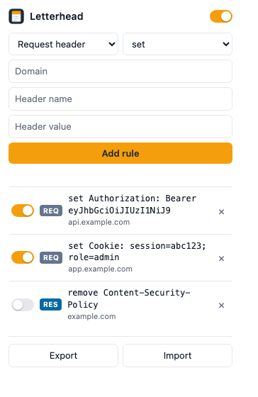

# Letterhead

A small Chrome extension that modifies HTTP headers on domains you explicitly grant.
The name is the metaphor: a header printed across the top of every page you send.

Header editors normally ask for access to every site you visit, which is a lot of
trust for an occasional debugging tool. This one asks for nothing at install and
requests a single domain at the moment you add a rule for it.

## Install

1. `chrome://extensions` → enable **Developer mode**
2. **Load unpacked** → select this folder

## Use

Pick **Request** or **Response**, pick `set` / `append` / `remove`, fill in domain,
header name and value, then **Add rule**. Chrome prompts for access to that one
domain; the rule only takes effect if you accept.

- The checkbox on a row toggles that rule; `×` deletes it and revokes the domain.
- **All rules enabled** at the top is a master switch — kill every rule without
  losing it, for when you go back to normal browsing.
- **Export** writes the rule list to JSON. **Import** adds rules disabled; enabling
  one is what triggers its host-access prompt, so an imported file can never
  silently gain access to anything.

### Cookies

Cookies need no special support: they are the `Cookie` request header and the
`Set-Cookie` response header. Two things to know:

- `set` on `Cookie` **replaces** the browser's entire cookie header for that
  domain, so any real session cookie is dropped unless you include it yourself.
  Use `append` to add one alongside what the browser already sends.
- Chrome only permits `append` on an allowlist of request headers. `cookie` is on
  it, along with `accept`, `cache-control`, `user-agent` and `x-forwarded-for` among
  others — but arbitrary `X-*` headers are not, and Chrome rejects such a rule.
  The popup shows the rejection rather than failing silently. Response headers are
  far less restricted.

Drafting a `Content-Security-Policy` works the same way: set it as a response
header and reload.

## Design

- Starts with **no** host permissions. `optional_host_permissions` means access is
  requested per domain, at the moment a rule goes live, and revoked when you delete it.
- `declarativeNetRequestWithHostAccess` — headers are rewritten by Chrome's rule engine.
  The extension never sees request or response contents, so there is nothing to exfiltrate.
- No background service worker, no content scripts, no remote code, no network calls.
  Dynamic rules persist across restarts on their own.
- Rules match the domain and its subdomains, but only where you granted access,
  so an ungranted subdomain fails closed.

## Not implemented

- **Tab- and window-scoped rules.** Chrome only supports `tabIds` on *session* rules,
  not the dynamic ones used here, which would mean a second rule lifecycle that
  disappears on restart.
- **Profiles, resource-type filters.** Per-rule toggles and the master switch cover
  the same ground at this size.

## License

MIT — see [LICENSE](LICENSE).
